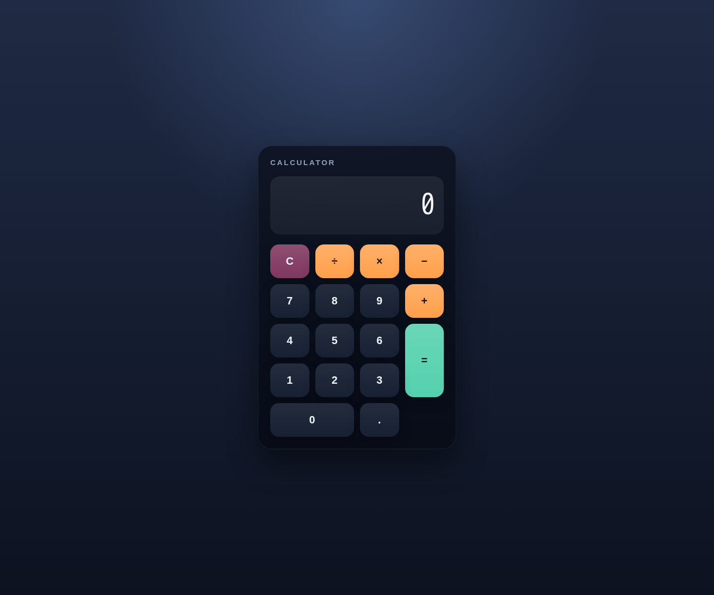
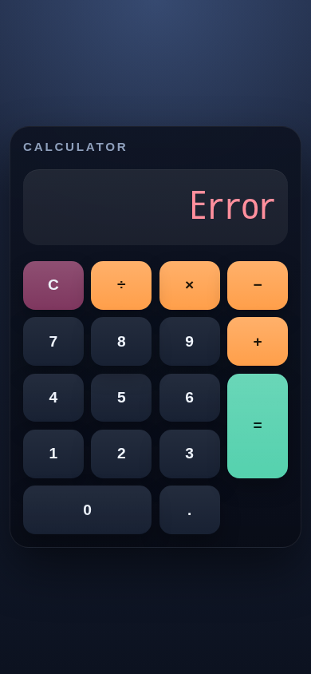

# Alex-Hou-2024-test-3

A small Flask calculator app with a styled browser UI, pure JavaScript calculator logic, edge-case handling, and lightweight unit tests.

## Features

- Flask application factory exposed through `wsgi.py` for Gunicorn.
- Responsive calculator layout with a dedicated display and button grid.
- Pure JavaScript calculator core with left-to-right evaluation.
- Edge-case handling for divide-by-zero, invalid sequences, recovery after errors, and compact large-number formatting.
- Unit tests using the built-in Node test runner.

## Project structure

```text
app/
  __init__.py
  config.py
  routes.py
  static/
    css/
      styles.css
    js/
      calculator.js
  templates/
    index.html
docs/
  screenshots/
    calculator-error-mobile.png
    calculator-home.png
    calculator-result.png
scripts/
  smoke_check.sh
tests/
  calculator.test.js
  test_static_assets.py
wsgi.py
requirements.txt
package.json
.env.example
Dockerfile
docker-compose.yml
README.md
```

## Requirements

- Python 3.13+
- Node.js 22+ for the JavaScript test runner
- Docker and Docker Compose for containerized runs

## Environment

Copy the example environment file before running the app:

```bash
cp .env.example .env
```

Default values:

- `FLASK_ENV=development`
- `HOST=0.0.0.0`
- `PORT=8080`

## Local development

Install the Python dependencies:

```bash
python3 -m pip install -r requirements.txt
```

Start the app with Gunicorn:

```bash
gunicorn --reload --bind 0.0.0.0:8080 wsgi:app
```

Then open `http://127.0.0.1:8080`.

Important: always access the calculator through Flask/Gunicorn at
`http://127.0.0.1:8080`. Do not open `app/templates/index.html` directly in a
browser; direct file access bypasses Flask's static URL generation and can show
an unstyled or scriptless page.

## Deployment smoke check

After installing dependencies, run the lightweight smoke check:

```bash
scripts/smoke_check.sh
```

The script starts `gunicorn --bind 0.0.0.0:8080 wsgi:app` and verifies:

- `GET /` returns rendered HTML with status `200`
- `GET /static/css/styles.css` returns status `200`
- `GET /static/js/calculator.js` returns status `200`

## Docker

Build and run the container directly:

```bash
docker build -t alex-hou-2024-test-3 .
docker run --rm -p 8080:8080 --env-file .env.example alex-hou-2024-test-3
```

Or use Docker Compose:

```bash
docker compose up --build
```

## Tests

Run the JavaScript unit tests with the built-in Node test runner:

```bash
npm test
```

Run the Flask static asset smoke tests:

```bash
python -m unittest discover -s tests -p 'test_*.py'
```

## Manual QA summary

Manual browser QA was performed on April 29, 2026 against the live Flask app served locally on `http://127.0.0.1:8080`.

Golden path verified:

- `12.5 + 7.5 = 20`

Edge cases verified:

- `8 ÷ 0 = Error`
- entering a digit after `Error` resets the display and starts a new input
- repeated decimal input is ignored
- invalid operator chaining is ignored
- large results switch to compact scientific notation, for example `9e+11`

## Screenshots

Default desktop calculator:



Successful calculation result:


Mobile divide-by-zero error state:


